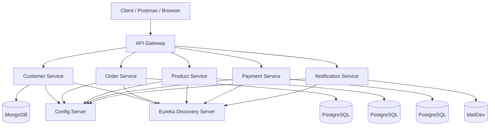
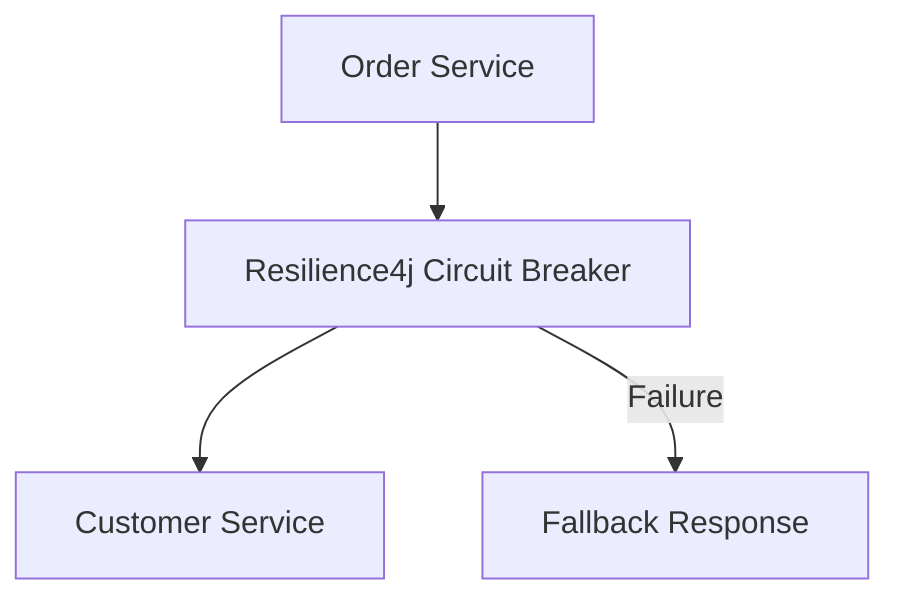
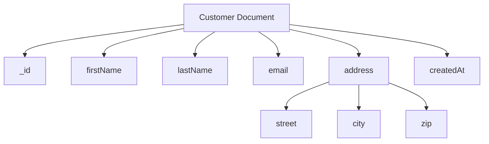
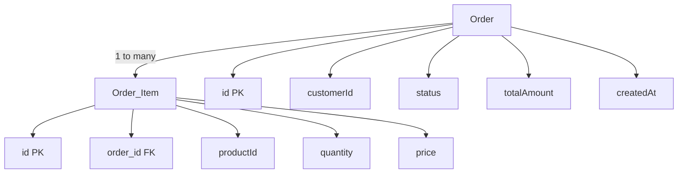

## 🛒 E-Commerce Microservices Platform

> A **production-ready Spring Boot microservices project** demonstrating Clean Architecture, CI/CD pipelines, Dockerized deployments, fault tolerance, and secure REST APIs.


---

## 📌 Features

* ✅ Microservices Architecture
* ✅ Clean Architecture & DDD
* ✅ Spring Cloud Config Server
* ✅ Eureka Service Discovery
* ✅ API Gateway (Centralized Routing)
* ✅ JWT Authentication & Authorization
* ✅ Circuit Breaker (Resilience4j)
* ✅ MongoDB & PostgreSQL
* ✅ Docker & Docker Compose
* ✅ CI/CD using GitHub Actions
* ✅ Swagger / OpenAPI Documentation

---

## 🧱 Clean Architecture Overview

Each service follows **Clean Architecture**:

```
Controller → Service → Domain → Repository
```

### Why Clean Architecture?

* Loose coupling
* High testability
* Easy scalability
* Clear separation of concerns

**Layers:**

* **Controller Layer** → REST APIs
* **Service Layer** → Business Logic
* **Domain Layer** → Core Models
* **Repository Layer** → DB Access

---

## 🏗 Architecture Diagrams

### Microservices Architecture Used in This Project





## 🗂 Services Overview

| Service          | Description         | Database   |
| ---------------- | ------------------- | ---------- |
| customer-service | Customer management | MongoDB    |
| product-service  | Product catalog     | PostgreSQL |
| order-service    | Order processing    | PostgreSQL |
| payment-service  | Payment handling    | PostgreSQL |
| api-gateway      | Routing & security  | —          |
| config-server    | Centralized config  | Git        |
| discovery-server | Service registry    | —          |

---

## 🗄 Database Design (ERD)




## 🔐 Security

* JWT Authentication
* Role-based authorization
* Secured endpoints via API Gateway
* OpenAPI Security Scheme (`Bearer Token`)

---

## 📄 API Documentation (Swagger)

Each service exposes Swagger UI:

| Service          | Swagger URL                                                                    |
| ---------------- | ------------------------------------------------------------------------------ |
| Customer Service | [http://localhost:8090/swagger-ui.html](http://localhost:8090/swagger-ui.html) |
| Product Service  | [http://localhost:8050/swagger-ui.html](http://localhost:8050/swagger-ui.html) |
| Order Service    | [http://localhost:8070/swagger-ui.html](http://localhost:8070/swagger-ui.html) | 

---

## 🐳 Docker & Deployment

```bash
docker-compose up -d
```

Includes:

* MongoDB
* PostgreSQL
* MailDev
* All microservices
* API Gateway

---

## 🔄 CI/CD Pipeline

* GitHub Actions
* Build & Test
* Docker Image Creation
* Versioned Artifacts
* Ready for EC2 / Cloud Deployment

---

## 🧪 Testing Strategy

* Unit Tests: JUnit + Mockito
* Layer-focused tests (Service-level)
* CI-friendly (no DB, no containers)
* Integration tests optional via Testcontainers

---

## 📈 Why This Project?

✔ Real-world microservices design
✔ Production-grade best practices
✔ CI/CD & DevOps ready
✔ Resume + Interview ready

---
